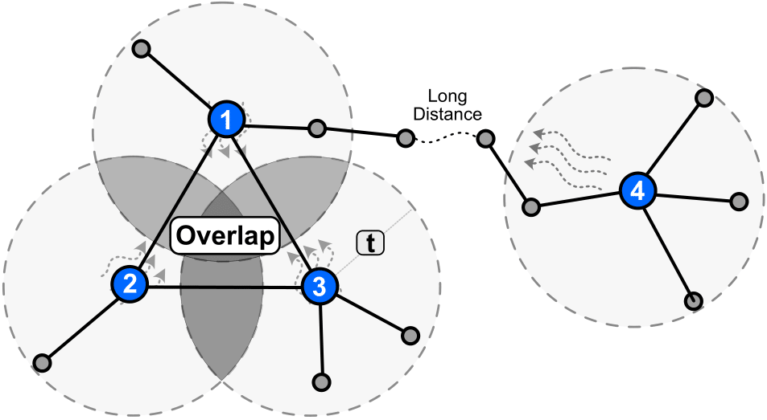
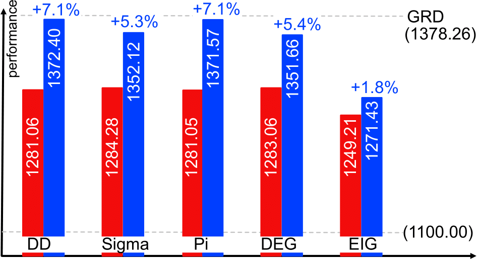

# SIM (Sobol Information Maximization)


This repository reproduces the results in the paper `Explain Influence Maximization with Sobol Indices` (Zonghan Zhang et al., SIAM Data Mining 2023), whose objective is to learn the higher-order relationship in selecting seeds in information maximization problem.


[](sim_intro.png)


## Usage

For empirical experiments in the paper, please refer to the files below:

```python
python case-study.py
```

Our result shows that the proposed lightweighted plugin can improve SOTA model by a significant margin

[](performance.png)

Inside our experiments, IC (independen cascade) and LT (linear threshold) will be evaluated on each method. Details for IC and LT can be found in
```
SIM-IC.py
SIM-LT.py
```


## Citation

If you compare with, build on, or use aspects of the SIM, please cite the following:
```
@inproceedings{zhang2023sim,
  title={Explain Influence Maximization with Sobol Indices},
  author={Zhang, Zonghan, and Zhiqian Chen},
  booktitle={Proceedings of SIAM International Conference on Data Mining (SDM)},
  year={2023},
}
```
